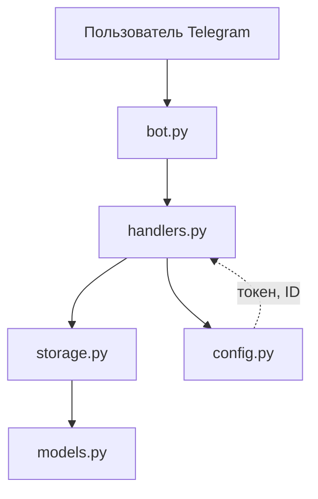

# Telegram CRM Bot

Асинхронный Telegram-бот для приёма и управления заявками (мини-CRM).
Клиенты оставляют заявки одним сообщением, менеджеры управляют их статусами через команды.

## Возможности

- Приём заявок от клиентов (сохранение имени, текста, времени)
- Просмотр всех заявок менеджерами (`/requests`)
- Смена статуса заявки (`/status <id> <статус>`)
- Разграничение доступа: команды управления доступны только менеджерам
- Асинхронная обработка на aiogram (event loop, конкурентные запросы)

## Стек

- Python 3.12
- aiogram 3.x (асинхронный фреймворк для Telegram Bot API)
- python-dotenv (конфигурация через переменные окружения)

## Архитектура



## Ограничения/планы

- Бот работает локально на вашем ПК
- Требует VPN в TUNNEL-режиме или иной способ получить доступ к Telegram (В РФ)
- История заявок не сохраняется при перезапуске (in-memory)
- В планах: перенос на PostgreSQL и деплой на VPS

## Установка

```bash
git clone git@github.com:kazumasatovich/telegram-crm-bot.git  
cd telegram-crm-bot  
python3 -m venv/bin/activate
source .venv/bin/activate  
pip install -e .  
```

## Настройка

Создай файл `.env` в корне проекта:

```
BOT_TOKEN=токен_от_@BotFather  
MANAGER_IDS=твой_telegram_id  
```

Токен получить у @BotFather, свой ID — у @userinfobot.

## Запуск

```bash
python -m crm_bot.bot  
```

## Команды бота

| Команда                 | Источник  |   Ответ                                 |
|-------------------------|-----------|-----------------------------------------|
| любой текст             | клиент    | создать заявку                          |
| `/requests`             | менеджер  | список всех заявок                      |
| `/status <id> <статус>` | менеджер  | сменить статус (новая/в работе/закрыта) |
