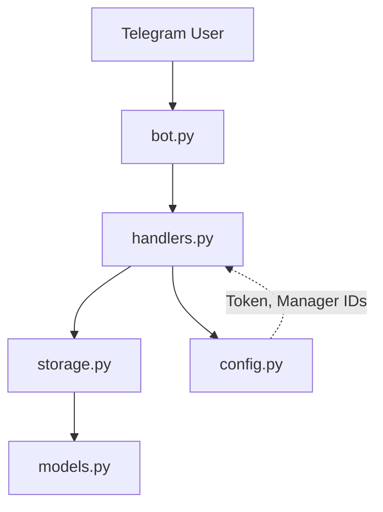
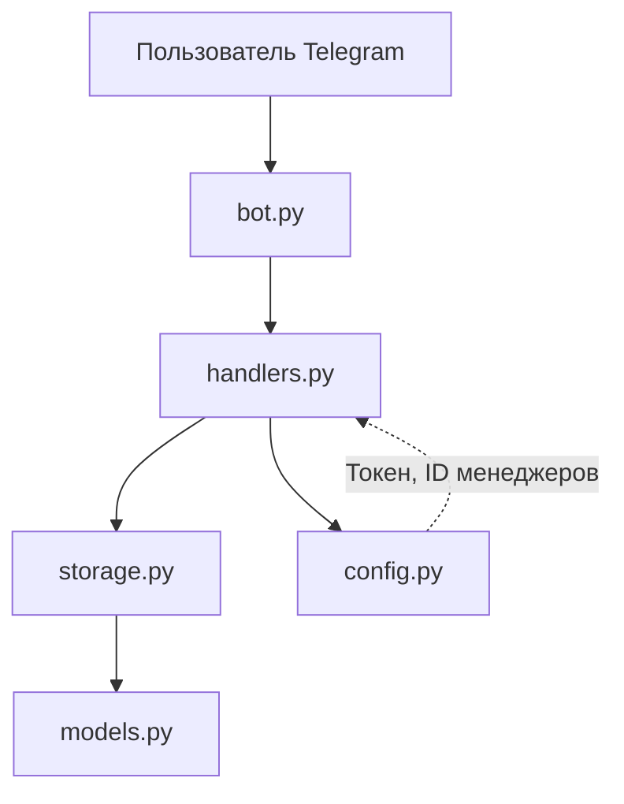

# Telegram CRM Bot

[English](#english) | [Русский](#русский)

---

## English

An asynchronous Telegram bot for receiving and managing customer requests (mini-CRM).  
Clients submit requests via simple messages, while managers track and update request statuses using commands.

### Features

- **Client request handling:** Automatically saves client name, text, and timestamp.
- **Manager view:** List all submitted requests using `/requests`.
- **Status management:** Update request progress via `/status <id> <status>`.
- **Access control:** Administrative commands are restricted to configured manager IDs.
- **Asynchronous architecture:** Built on `aiogram 3.x` leveraging Python's event loop for high concurrency.

### Tech Stack

- **Python:** 3.12+
- **Framework:** `aiogram 3.x`
- **Environment Management:** `python-dotenv`

### Architecture



### Limitations & Roadmap

- **Storage:** In-memory storage (data resets upon application restart).
- **Hosting:** Runs locally on host machine.
- **Roadmap:** Integrate **PostgreSQL** database and deploy to a remote VPS.

### Installation

```bash
git clone git@github.com:kazumasatovich/telegram-crm-bot.git
cd telegram-crm-bot
python3 -m venv .venv
source .venv/bin/activate
pip install -e .
```

### Configuration

Create a `.env` file in the root directory:

```env
BOT_TOKEN=your_token_from_BotFather
MANAGER_IDS=your_telegram_id
```

> Obtain `BOT_TOKEN` from [@BotFather](https://t.me/BotFather) and your `MANAGER_IDS` from [@userinfobot](https://t.me/userinfobot).

### Running the Bot

```bash
python -m crm_bot.bot
```

### Commands

| Command | Role | Description |
|---|---|---|
| Any text message | Client | Creates a new request |
| `/requests` | Manager | Lists all requests |
| `/status <id> <status>` | Manager | Updates request status (`new`/`in_progress`/`closed`) |

---

## Русский

Асинхронный Telegram-бот для приёма и управления заявками (мини-CRM).  
Клиенты оставляют заявки одним сообщением, менеджеры управляют их статусами через команды.

### Возможности

- **Приём заявок от клиентов:** Сохранение имени, текста и времени отправки.
- **Просмотр всех заявок:** Доступен менеджерам по команде `/requests`.
- **Смена статуса заявки:** Управление через `/status <id> <статус>`.
- **Разграничение доступа:** Команды управления доступны только авторизованным менеджерам.
- **Асинхронная обработка:** Построена на `aiogram 3.x` с использованием event loop для обработки конкурентных запросов.

### Стек

- **Python:** 3.12+
- **Фреймворк:** `aiogram 3.x`
- **Управление конфигурацией:** `python-dotenv`

### Архитектура



### Ограничения и планы

- **Хранение данных:** В памяти (In-Memory), история сбрасывается при перезапуске.
- **Запуск:** Локальный запуск на ПК (в РФ требуется VPN в TUNNEL-режиме или прокси для взаимодействия с Telegram API).
- **В планах:** Перенос хранения данных на **PostgreSQL** и деплой на VPS.

### Установка

```bash
git clone git@github.com:kazumasatovich/telegram-crm-bot.git
cd telegram-crm-bot
python3 -m venv .venv
source .venv/bin/activate
pip install -e .
```

### Настройка

Создайте файл `.env` в корне проекта:

```env
BOT_TOKEN=токен_от_@BotFather
MANAGER_IDS=твой_telegram_id
```

> Токен можно получить у [@BotFather](https://t.me/BotFather), а свой Telegram ID — у [@userinfobot](https://t.me/userinfobot).

### Запуск

```bash
python -m crm_bot.bot
```

### Команды бота

| Команда | Источник | Ответ / Действие |
|---|---|---|
| Любой текст | Клиент | Создать заявку |
| `/requests` | Менеджер | Список всех заявок |
| `/status <id> <статус>` | Менеджер | Сменить статус (`новая` / `в работе` / `закрыта`) |
