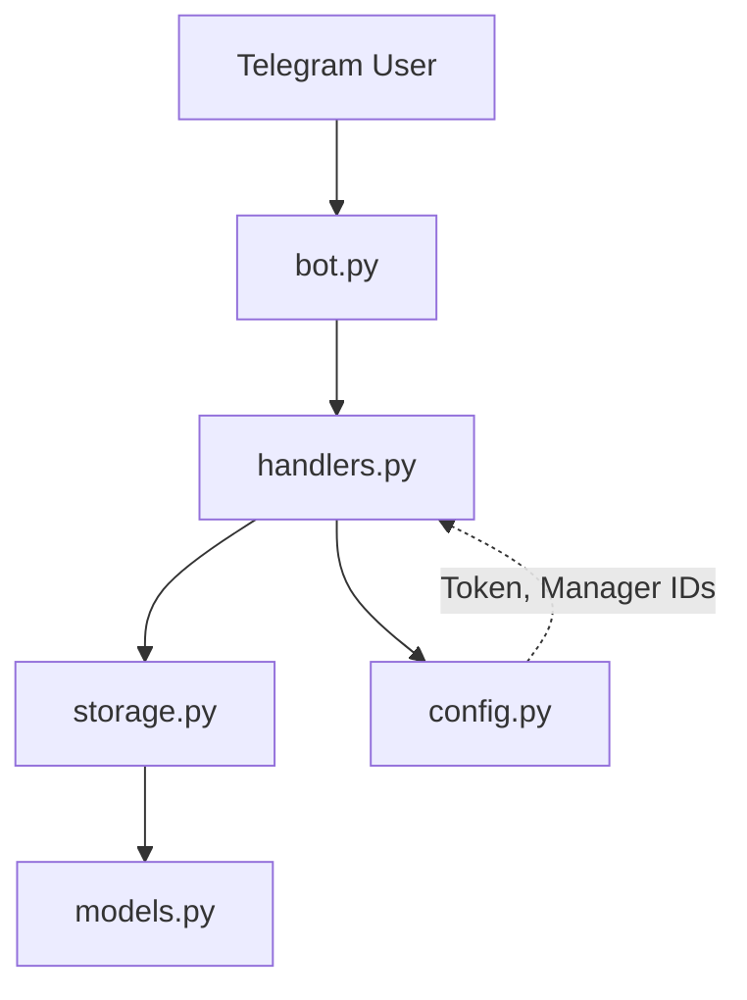
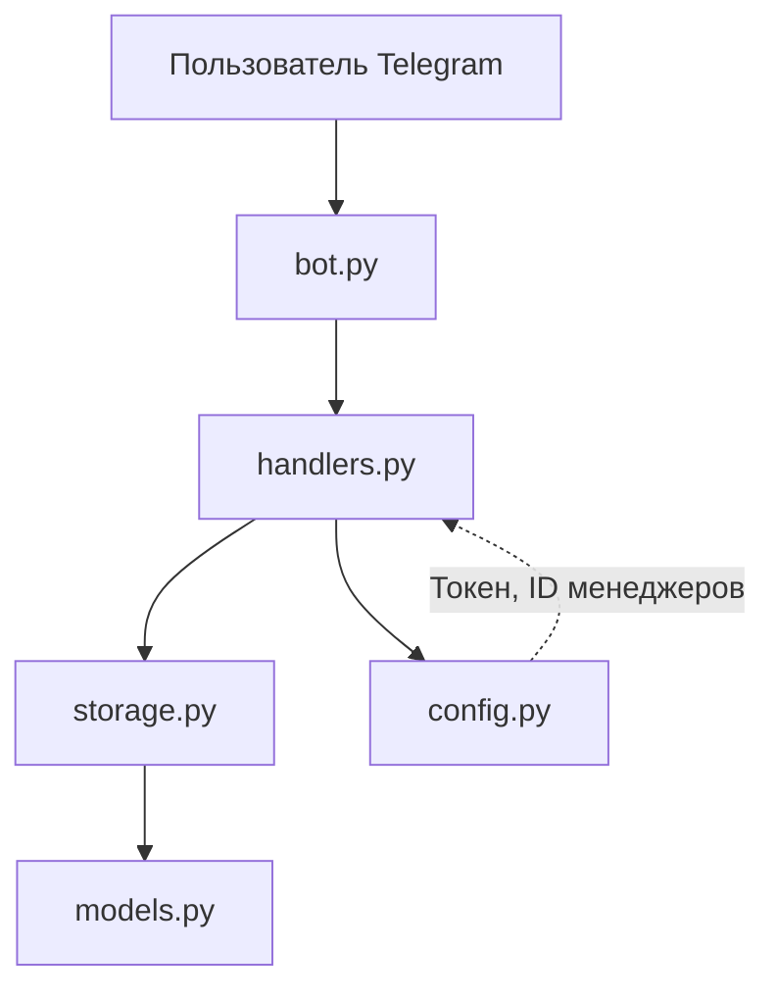

# Telegram CRM Bot

[English](#english) | [Русский](#русский)

---

## English

An asynchronous Telegram bot for receiving and managing customer requests (mini-CRM).  
Clients submit requests via simple messages, while managers track and update request statuses using commands.

### Features

- **Client request handling:** Automatically saves client name, text, and timestamp.
- **Manager view:** List all submitted requests using `/requests`.
- **Status management:** Update request progress via `/status <id> <status>`.
- **Access control:** Administrative commands are restricted to configured manager IDs.
- **Asynchronous architecture:** Built on `aiogram 3.x` leveraging Python's event loop for high concurrency.

### Tech Stack

- **Python:** 3.12+
- **Framework:** `aiogram 3.x`
- **Environment Management:** `python-dotenv`

### Architecture


```mermaid
flowchart TD
    U[Telegram User] --> B[bot.py]
    B --> H[handlers.py]
    H --> S[storage.py]
    H --> C[config.py]
    S --> M[models.py]
    C -.->|Token, Manager IDs| H
```

### Limitations & Roadmap

- **Clearing the request storage when restarting the bot:** in progress at issue #2
- **Launch:** A VPN in TUNNEL mode is required for local launch in the Russian Federation.
- **Roadmap:** Integrate **PostgreSQL** database.

### Installation

```bash
git clone https://github.com/kazumasatovich/telegram-crm-bot
cd telegram-crm-bot
python3 -m venv .venv
source .venv/bin/activate
pip install -e .
```

### Configuration

Create a `.env` file in the root directory:

```env
BOT_TOKEN=your_token_from_BotFather
MANAGER_IDS=your_telegram_id
```

> Obtain `BOT_TOKEN` from [@BotFather](https://t.me/BotFather) and your `MANAGER_IDS` from [@userinfobot](https://t.me/userinfobot).

### Running the Bot

```bash
python -m crm_bot.bot
```

### Troubleshooting

Configuration check starts before connection to Telegram API.

#### Error: `BOT_TOKEN not found, get it from @BotFather and put it in .env`
- **Return code:** 1
- **Reason:** The `BOT_TOKEN` variable is missing.
- **Solution:** Check the BOT_TOKEN with [@BotFather](https://t.me/BotFather) and write it to `.env`.

#### Error: `MANAGER_IDS is empty or not set; get it from @userinfobot and put it in .env`
- **Return code:** 1
- **Reason:** The `MANAGER_IDS` variable is missing or has no numeric value
- **Solution:** Check the ID with [@userinfobot](https://t.me/userinfobot) and write it to `.env`.

The health check is performed before polling starts.

#### Error: `Error connection to Telegram, check your network`
- **Return code:** 1
- **Reason:** The network does not allow access to Telegram servers.
- **Solution:** Check your network or enable VPN (TUN mode).

#### Error: `Telegram server says - Unauthorized`
- **Return code:** 1
- **Reason:** The bot token in `.env` is invalid.
- **Solution:** Check the validity of the token with [@BotFather](https://t.me/BotFather).

### Docker

Build the image:

```bash
docker build -t telegram-crm-bot .
```

Run the container (secrets are passed at runtime via `--env-file` and are never baked into the image):

```bash
docker run -d \
  --name telegram-crm-bot \
  --env-file .env \
  --restart unless-stopped \
  telegram-crm-bot
```

The `--restart unless-stopped` flag ensures that the bot will automatically restart if it crashes or the server restarts (unless it is manually stopped).

> `.env` is excluded from the build context via `.dockerignore`, so the token never appears in image layers.

### Deploy
The bot is deployed on a VPS (Ubuntu 24.04 LTS) in a Docker container.

1. Clone the repository: `git clone https://github.com/kazumasatovich/telegram-crm-bot && cd telegram-crm-bot`

2. Create an `.env` file with the keys `BOT_TOKEN` and `MANAGER_IDS`.

3. Build and run the container.

4. The status and logs can be checked using the commands `docker ps` and `docker logs -f telegram-crm-bot`.

### Commands

| Command | Role | Description |
|---|---|---|
| Any text message | Client | Creates a new request |
| `/requests` | Manager | Lists all requests |
| `/status <id> <status>` | Manager | Updates request status (`new`/`in_progress`/`closed`) |

---

## Русский

Асинхронный Telegram-бот для приёма и управления заявками (мини-CRM).  
Клиенты оставляют заявки одним сообщением, менеджеры управляют их статусами через команды.

### Возможности

- **Приём заявок от клиентов:** Сохранение имени, текста и времени отправки.
- **Просмотр всех заявок:** Доступен менеджерам по команде `/requests`.
- **Смена статуса заявки:** Управление через `/status <id> <статус>`.
- **Разграничение доступа:** Команды управления доступны только авторизованным менеджерам.
- **Асинхронная обработка:** Построена на `aiogram 3.x` с использованием event loop для обработки конкурентных запросов.

### Стек

- **Python:** 3.12+
- **Фреймворк:** `aiogram 3.x`
- **Управление конфигурацией:** `python-dotenv`

### Архитектура


```mermaid
flowchart TD
    U[Пользователь Telegram] --> B[bot.py]
    B --> H[handlers.py]
    H --> S[storage.py]
    H --> C[config.py]
    S --> M[models.py]
    C -.->|Токен, ID менеджеров| H
```

### Ограничения и планы

- **Очищение хранилища запросов при перезапуске бота:** решается в issue #2
- **Запуск:** для локального запуска в РФ требуется VPN в TUNNEL-режиме.
- **В планах:** Перенос хранения данных на **PostgreSQL**.

### Установка

```bash
git clone https://github.com/kazumasatovich/telegram-crm-bot
cd telegram-crm-bot
python3 -m venv .venv
source .venv/bin/activate
pip install -e .
```

### Настройка

Создайте файл `.env` в корне проекта:

```env
BOT_TOKEN=токен_от_@BotFather
MANAGER_IDS=твой_telegram_id
```

> Токен можно получить у [@BotFather](https://t.me/BotFather), а свой Telegram ID — у [@userinfobot](https://t.me/userinfobot).

### Запуск

```bash
python -m crm_bot.bot
```

### Частые ошибки

Проверка конфигурации начинается перед подключением к Telegram API.

#### Ошибка: `BOT_TOKEN not found, get it from @BotFather and put it in .env`
- **Код возврата:** 1
- **Причина:** Переменная `BOT_TOKEN` отсутствует.
- **Решение:** Проверьте BOT_TOKEN у [@BotFather](https://t.me/BotFather) и запишите его в `.env`.

#### Ошибка: `MANAGER_IDS is empty or not set; get it from @userinfobot and put it in .env`
- **Код возврата:** 1
- **Причина:** Переменная `MANAGER_IDS` отсутствует, либо не имеет числового значения
- **Решение:** Проверьте ID у [@userinfobot](https://t.me/userinfobot) и запишите его в `.env`.

Проверка работоспособности (health-check) выполняется до старта polling.

#### Ошибка: `Error connection to Telegram, check your network`
- **Код возврата:** 1
- **Причина:** Сеть не позволяет обратиться к серверам Telegram.
- **Решение:** Проверьте подключение к сети или включите VPN (в режиме TUN).

#### Ошибка: `Telegram server says - Unauthorized`
- **Код возврата:** 1
- **Причина:** В `.env` указан неверный или недействительный токен бота.
- **Решение:** Проверьте действительность токена у [@BotFather](https://t.me/BotFather).

### Docker

Собрать образ:

```bash
docker build -t telegram-crm-bot .
```

Запустить контейнер (секреты передаются в рантайме через `--env-file` и не попадают в образ):

```bash
docker run -d \
  --name telegram-crm-bot \
  --env-file .env \
  --restart unless-stopped \
  telegram-crm-bot
```

Флаг `--restart unless-stopped` гарантирует автоматический перезапуск бота при сбоях или перезагрузке сервера (если он не был остановлен вручную).

> `.env` исключён из контекста сборки через `.dockerignore`, поэтому токен не попадает в слои образа.

### Деплой
Бот разворачивается на VPS (Ubuntu 24.04 LTS) в Docker-контейнере.

1. Клонируйте репозиторий: `git clone https://github.com/kazumasatovich/telegram-crm-bot && cd telegram-crm-bot`

2. Создайте файл `.env` с ключами `BOT_TOKEN` и `MANAGER_IDS`.

3. Соберите и запустите контейнер.

4. Состояние и логи проверяются командами `docker ps` и `docker logs -f telegram-crm-bot`.

### Команды бота

| Команда | Источник | Ответ / Действие |
|---|---|---|
| Любой текст | Клиент | Создать заявку |
| `/requests` | Менеджер | Список всех заявок |
| `/status <id> <статус>` | Менеджер | Сменить статус (`новая` / `в работе` / `закрыта`) |
